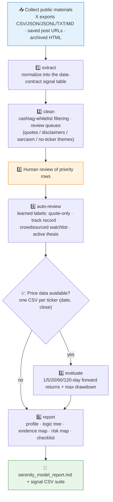

# 🛰️ Serenity Research Model Skill

[简体中文](README.md) | **English**

> Reverse-engineer Serenity's (@aleabitoreddit) public research logic from X posts: an `extract → clean → auto-review → evaluate → report` pipeline that decomposes posts into minimal signal units and back-checks how public calls behaved against later price action.


---

## 📖 What This Is

`serenity-research-model` is a **portable agent skill** that turns Serenity's public X posts, saved threads, and exported datasets into a reusable research model. The goal is not to verify private profits or copy trades — it is to **reverse-engineer observable reasoning patterns from public posts** and test how those public signals behaved afterward.

It ships with a complete Python pipeline (`scripts/serenity_mvp.py`): signal extraction, cashtag-whitelist cleaning, review queues for quotes/disclaimers/sarcasm-like language, learned semantic auto-labeling, forward-return evaluation (1/5/20/60/120 trading days plus max drawdown), and final report generation. `validation/` contains the Top-200 human-review report and the final research-model documents as the quality baseline.

This repo is the **first instance** of the methodology; its generalized version is the sister repository [`skill-x-trader-builder`](https://github.com/quantskills/skill-x-trader-builder).

> ⚠️ No private-return verification, no copy-trading; all public return claims are treated as unverified.

---

## ⚡ Pipeline



---

## 🗂️ CLI Subcommands × I/O

| Subcommand | Input | Output |
| --- | --- | --- |
| `extract` | `--posts` export (csv/json/jsonl/txt/md; minimum `created_at`+`text`) | raw signal table |
| `clean` | `--signals` + `--posts` (or `--ticker-stats` fallback) | cleaned signals + `manual_review_queue.csv` + `quote_relationships.csv` |
| `auto-review` | `--signals` human-reviewed queue | semantically labeled `*_reviewed.csv` |
| `evaluate` | `--signals` + `--prices` dir (`<TICKER>.csv`) | `signal_evaluation.csv` (forward returns + drawdown) |
| `report` | `--signals` (merges existing evaluation output) | `serenity_model_report.md` |

Each signal is decomposed at the smallest useful unit: ticker, theme/subtheme, bottleneck claim, supply-chain role, evidence type, catalyst, time horizon, risk marker, conviction signal, and follow-up/revision relationship.

---

## 🚀 Quick Start

### 1️⃣ Install

```bash
# Claude Code (global)
cp -r skill-serenity-research-model ~/.claude/skills/serenity-research-model
```

For Codex / OpenClaw-style platforms, import with the `SKILL.md` + `references/` + `scripts/` structure intact; `agents/openai.yaml` provides the OpenAI/Codex adapter.

### 2️⃣ Trigger examples

```text
Turn this Serenity post export into a research model
Run the serenity pipeline; price data is in prices/
Which of these signals are quote-only and which are genuine forward theses?
```

### 3️⃣ Run the pipeline directly

```bash
python scripts/serenity_mvp.py extract     --posts posts.csv --out run1
python scripts/serenity_mvp.py clean       --signals run1/signals.csv --posts posts.csv --out run1
python scripts/serenity_mvp.py auto-review --signals run1/manual_review_queue.csv --out run1
python scripts/serenity_mvp.py evaluate    --signals run1/signals.csv --prices prices/ --out run1
python scripts/serenity_mvp.py report      --signals run1/signals.csv --out run1
```

---

## 📦 Repository Layout

```text
skill-serenity-research-model/
├── SKILL.md                                      # Skill entrypoint: 6-step workflow + interpretation rules + output contract
├── scripts/
│   └── serenity_mvp.py                           # 🐍 extract/clean/auto-review/evaluate/report pipeline
├── references/
│   ├── trader_profile.md                         # 🧑‍💻 Public account profile
│   ├── data_contract.md                          # 📋 Signal-table field contract
│   ├── serenity_axes.md                          # 🧭 Observation → model conversion axes
│   ├── research_template.md                      # 📄 Research-model report template
│   ├── review_rules.md                           # 🏷️ Semantic review rules
│   ├── source_boundary.md                        # 🚧 Public-source boundary
│   └── source_notes.md                           # 🗒️ Data-source notes
├── validation/                                   # ✅ Human-review and final-model baseline
│   ├── manual_review_top200_report_zh.md
│   ├── semantic_filter_summary.md
│   ├── signal_evaluation_summary.md
│   ├── serenity_research_model_zh.md
│   ├── serenity_forward_research_model_zh.md
│   └── serenity_high_quality_thesis_template_zh.md
└── agents/
    └── openai.yaml                               # OpenAI/Codex adapter
```

---

## 📐 Core Constraints

| Constraint | Detail |
| --- | --- |
| 🌐 Public materials only | User-provided exports, public post URLs, archived pages; record source and retrieval date |
| 🧾 No return endorsement | Screenshots, follower counts, viral return numbers are all marked "unverified" |
| ✂️ Own words vs quotes | Separate the account's own statements from quoted text; quote rows get their own table |
| ⚖️ Winner-bias control | Failed, stale, and revised ideas are tracked with the same care as winners |
| 📉 Research ≠ price-moving | Viral spread can itself become the catalyst and is marked separately |
| 🚫 Describe, don't recommend | Outputs are research structure and fact synthesis, never investment advice |
| 📦 Git hygiene | No raw exports, large CSVs, or price histories in the repo |

---

## ⚠️ Disclaimer

This repository reverse-engineers a research method from public materials only. It is not affiliated with Serenity, does not verify any performance claims, and does not constitute investment advice.

## 📜 License

This project is licensed under the GNU General Public License v3.0. See [LICENSE](LICENSE).
