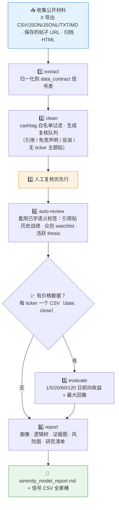

# 🛰️ Serenity Research Model Skill

**简体中文** | [English](README.en.md)

> 从 Serenity（@aleabitoreddit）的公开 X 帖子里逆向研究逻辑：`extract → clean → auto-review → evaluate → report` 五段流水线，把帖子拆成最小信号单元，并用价格数据回看公开 call 的后续表现。


---

## 📖 这是什么

`serenity-research-model` 是一个**便携 Agent Skill**：把 Serenity 的公开 X 帖子、保存的 thread、导出数据集，重构成可复用的研究模型。目标不是验证私人收益或跟单，而是**逆向公开帖子里可观察的推理模式**，并检验这些公开信号事后的价格表现。

它内置一个完整的 Python 流水线（`scripts/serenity_mvp.py`）：信号提取、cashtag 白名单清洗、引用/免责/反讽语句的复核队列、语义自动标注、前向收益评估（1/5/20/60/120 个交易日 + 最大回撤）和最终报告生成。`validation/` 里保存了 Top200 人工复核报告和最终研究模型文档，作为质量基线。

本仓库是该方法论的**第一个实例**，其通用化版本是姊妹仓库 [`skill-x-trader-builder`](https://github.com/quantskills/skill-x-trader-builder)。

> ⚠️ 不验证私人组合收益、不跟单、公开晒单一律按「未验证」处理。

---

## ⚡ 流水线



---

## 🗂️ CLI 子命令 × 输入输出

| 子命令 | 输入 | 产出 |
| --- | --- | --- |
| `extract` | `--posts` 帖子导出（csv/json/jsonl/txt/md，最少含 `created_at`+`text`） | 原始信号表 |
| `clean` | `--signals` + `--posts`（或 `--ticker-stats` 兜底） | 清洗后信号 + `manual_review_queue.csv` + `quote_relationships.csv` |
| `auto-review` | `--signals` 人工复核后的队列 | 带语义标签的 `*_reviewed.csv` |
| `evaluate` | `--signals` + `--prices` 价格目录（`<TICKER>.csv`） | `signal_evaluation.csv`（前向收益 + 回撤） |
| `report` | `--signals`（自动并入已有评估结果） | `serenity_model_report.md` |

每条信号在最小单元上分解：ticker、主题/子主题、瓶颈论断、供应链角色、证据类型、催化、时间窗、风险标记、信心信号、跟进/修正关系。

---

## 🚀 快速开始

### 1️⃣ 安装

```bash
# Claude Code（全局）
cp -r skill-serenity-research-model ~/.claude/skills/serenity-research-model
```

Codex / OpenClaw 等平台：保持 `SKILL.md` + `references/` + `scripts/` 结构导入；`agents/openai.yaml` 提供 OpenAI/Codex 适配。

### 2️⃣ 触发示例

```text
把这份 Serenity 帖子导出整理成研究模型
跑一遍 serenity 流水线，价格数据在 prices/ 目录
这批信号里哪些是引用贴、哪些是真正的前瞻 thesis？
```

### 3️⃣ 直接跑流水线

```bash
python scripts/serenity_mvp.py extract     --posts posts.csv --out run1
python scripts/serenity_mvp.py clean       --signals run1/signals.csv --posts posts.csv --out run1
python scripts/serenity_mvp.py auto-review --signals run1/manual_review_queue.csv --out run1
python scripts/serenity_mvp.py evaluate    --signals run1/signals.csv --prices prices/ --out run1
python scripts/serenity_mvp.py report      --signals run1/signals.csv --out run1
```

---

## 📦 目录结构

```text
skill-serenity-research-model/
├── SKILL.md                                      # 技能入口：六步工作流 + 解释规则 + 输出契约
├── scripts/
│   └── serenity_mvp.py                           # 🐍 extract/clean/auto-review/evaluate/report 流水线
├── references/
│   ├── trader_profile.md                         # 🧑‍💻 公开账号画像
│   ├── data_contract.md                          # 📋 信号表字段契约
│   ├── serenity_axes.md                          # 🧭 观察 → 模型的转换轴
│   ├── research_template.md                      # 📄 研究模型报告模板
│   ├── review_rules.md                           # 🏷️ 语义复核规则
│   ├── source_boundary.md                        # 🚧 公开资料边界
│   └── source_notes.md                           # 🗒️ 数据来源笔记
├── validation/                                   # ✅ 人工复核与最终模型基线
│   ├── manual_review_top200_report_zh.md
│   ├── semantic_filter_summary.md
│   ├── signal_evaluation_summary.md
│   ├── serenity_research_model_zh.md
│   ├── serenity_forward_research_model_zh.md
│   └── serenity_high_quality_thesis_template_zh.md
└── agents/
    └── openai.yaml                               # OpenAI/Codex 适配
```

---

## 📐 核心约束

| 约束 | 说明 |
| --- | --- |
| 🌐 只用公开材料 | 用户提供的导出、公开帖子 URL、归档页面；记录来源与抓取日期 |
| 🧾 收益声明不背书 | 截图、粉丝量、病毒式回报数字一律标「未验证」 |
| ✂️ 引用与本人观点分离 | 区分账号本人的话和被引用文字，引用贴单独建表 |
| ⚖️ 赢家偏差防控 | 失败、过期、被修正的观点与成功观点同等入库 |
| 📉 研究贴 ≠ 拉盘贴 | 病毒式传播本身可能成为催化，需单独标记 |
| 🚫 只述不荐 | 输出研究结构与事实归纳，不构成任何投资建议 |
| 📦 Git 卫生 | 不提交原始导出、大型 CSV 与价格历史数据 |

---

## ⚠️ 免责声明

本仓库仅对公开材料做研究方法层面的逆向与归纳，不代表 Serenity 本人，不验证任何收益声明，不构成任何投资建议。

## 📜 License

This project is licensed under the GNU General Public License v3.0. See [LICENSE](LICENSE).

## 🐼 PandaAI / QUANTSKILLS 社群

<div align="center">
  
  <br>
  <sub>扫码加入 PandaAI 社群，交流 QUANTSKILLS 技能、Agent 工作流与量化研究实践。</sub>
</div>
